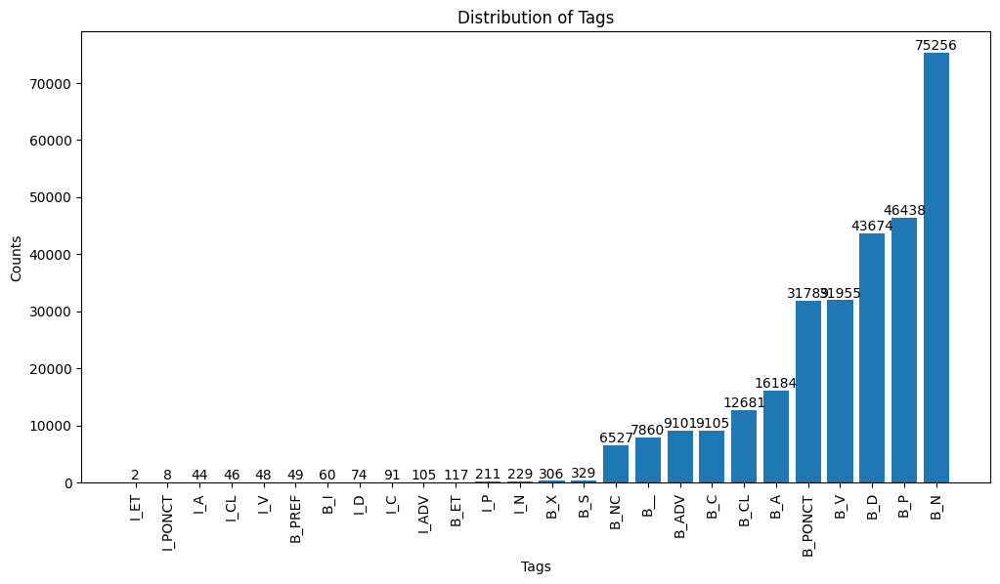

### Multi word expression (MWE) classifier with multi layer perceptron(MLP)


1. The corpus used to train the classifier can be found in the folder "corpus":

   We extracted simple mwe tags("B", "I", or "B", "I", "O") combined the pos tags. 

   ***

   Problem with the training corpus: The annotation of part of speech tags is not coherent, one half of the corpus is annotated in UD POS format another half in abbreviated pos format.
   ***

   The ML task multi-class classification tasks

2. How to train the model 

   a. You can either train the model on jupyter notebook witht he script provided in the train

   

3. How to run the script to train the classifier:

   

4. Training result:

   

5. Further improvement and optimization: 

### 

### Stats:

```
[('B_I', 2), ('I_ET', 2), ('I_PONCT', 8), ('I_CL', 21), ('I_PRO', 25), ('I_A', 44), ('I_V', 48), ('B_PREF', 49), ('B_INTJ', 58), ('I_D', 74), ('I_C', 91), ('I_ADV', 105), ('B_ET', 117), ('I_P', 211), ('I_N', 229), ('B_X', 306), ('B_SYM', 329), ('B_PRO', 571), ('B_CL', 969), ('B_C', 1102), ('B_PART', 1198), ('B_SCONJ', 1769), ('B_A', 2170), ('B_V', 3916), ('B_PONCT', 4282), ('B_P', 5435), ('B_D', 5470), ('B_AUX', 5540), ('B_CONJ', 6234), ('B_NUM', 6527), ('B__', 7860), ('B_ADV', 9101), ('B_N', 9750), ('B_PRON', 11141), ('B_ADJ', 14014), ('B_PROPN', 19376), ('B_VERB', 22499), ('UNK', 23234), ('B_PUNCT', 27507), ('B_DET', 38204), ('B_ADP', 39805), ('B_NOUN', 46130)]
```



### 

### I. Fixed length input with a context window - Vanilla MLP(Baseline)  

## Train a MLP Model

The set of hyparameters used:

```
batch_size    = 64
window_size   =  6#left context and right context
lr            = 1e-2
device        = "cpu"
epochs        = 5
emb_size      = 64
hidden_size   = 64
nb_layers     = 2
drop_out      = 0.1
```

### Training results 

```
100%|███████████████████████████████████████| 3945/3945 [01:16<00:00, 51.45it/s]
100%|████████████████████████████████████████| 987/987 [00:02<00:00, 451.89it/s]
Epoch 0 | Mean train loss  0.3498 |  Mean dev loss  0.2900 
100%|███████████████████████████████████████| 3945/3945 [01:19<00:00, 49.63it/s]
100%|████████████████████████████████████████| 987/987 [00:02<00:00, 419.44it/s]
Epoch 1 | Mean train loss  0.2274 |  Mean dev loss  0.1945 
100%|███████████████████████████████████████| 3945/3945 [01:19<00:00, 49.69it/s]
100%|████████████████████████████████████████| 987/987 [00:02<00:00, 454.83it/s]
Epoch 2 | Mean train loss  0.1833 |  Mean dev loss  0.1621 
100%|███████████████████████████████████████| 3945/3945 [01:18<00:00, 50.06it/s]
100%|████████████████████████████████████████| 987/987 [00:02<00:00, 459.71it/s]
Epoch 3 | Mean train loss  0.1669 |  Mean dev loss  0.1561 
100%|███████████████████████████████████████| 3945/3945 [01:21<00:00, 48.57it/s]
100%|████████████████████████████████████████| 987/987 [00:02<00:00, 423.74it/s]
Epoch 4 | Mean train loss  0.1744 |  Mean dev loss  0.1453 
100%|████████████████████████████████████████| 612/612 [00:03<00:00, 159.73it/s]
AVR: Precision 0.3495 | Recall  0.3055 |  F-score  0.3133 
Weighted: Precision 0.8804 | Recall  0.8889 |  F-score  0.8983 
```


### II. RNN and CRF sequential input


RNN , tags: B, I, O

```
Epoch 14 | Mean train loss  0.2143 |  Mean dev loss  0.4066 
weighted_f1_score
tensor(0.9777)
tensor(0.9993)
tensor(0.9993)
```


